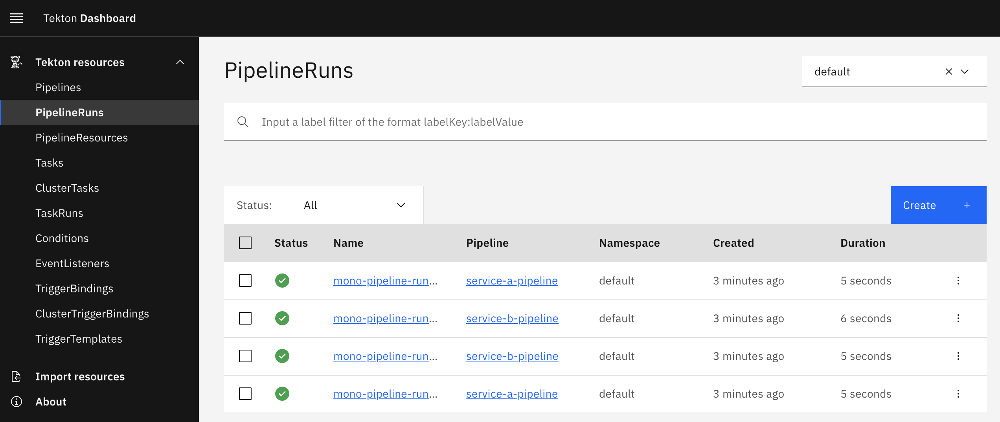

The full code described in this post can be found on [Github](https://github.com/janakerman/tekton-mono-repo-demo).

As a learning exercise, I wanted to see how I could put together a pipeline for a mono-repo with [Tekton](https://tekton.dev/). This post outlines a setup that supports the execution of _multiple_ pipelines from a single Github push event, learning a little about Tekton interceptors along the way.


## Tekton

[Tekton](https://tekton.dev/) is an open-source framework for creating CI/CD systems. Tekton uses Kubernetes Custom Resource Definitions to define pipelines, and orchestrates the pipeline stages as Kubernetes pods.

## The problem

Typically, a CD pipeline would be initiated by a Git webhook (i.e a Github push event), triggering a pipeline to run for the associated Git repository. These
pipelines are usually defined in YAML (e.g Gitlab's `.gitlab-ci.yaml`, or Travis' `.travis.yaml`).

Most CI/CD tools have the following features in common:
* A set of stages that form a DAG (Directed Acyclic Graph)
* Conditional logic to support optional build stages

Modelling a mono-repository with the above features has a few issues:
1. Poor visibility of a sub-project within the mono-repo as a single pipeline is _shared_
2. Pipeline definitions become increasingly complex, filled with conditional stages

Using Tekton's building blocks, I wanted to see if I could trigger a _different_ pipeline depending on the sub-directories that were modified for a given Git event.

## Tekton Triggers

[Triggers](https://github.com/tektoncd/triggers) is the sub-project of Tekton that is responsible for triggering pipelines in response to external events via webhooks. Tekton's own documentation gives a good overview.

> EventListeners expose an addressable “Sink” to which incoming events are directed. Users can declare TriggerBindings to extract fields from events, and apply them to TriggerTemplates in order to create Tekton resources. In addition, EventListeners allow lightweight event processing using Event Interceptors.

At a high level, an `EventListener` defines the endpoint for incoming events, passes the events off to a list of `Trigger` resources. These `Trigger` resources define how to map the event to a given pipeline's input parameters.  

A Tekton `Trigger` can define interceptors that allow you to process webhook payloads before any pipeline gets triggered, potentially deciding not to trigger any pipeline at all. 

Tekton comes bundled with some out of the box interceptors:

* Interceptors for common webhook sources such as Gitlab, Github, Bitbucket. These handle signature verification and provide filtering for specific event types.
* A [CEL Interceptor](https://tekton.dev/docs/triggers/eventlisteners/#cel-interceptors) that uses the CEL expression language to transform webhook payloads and evaluate predicates.
* [Webhook interceptors](https://tekton.dev/docs/triggers/eventlisteners/#webhook-interceptors) for implementing custom webhook processing.


## The solution

In the pipeline setup described by this post, there's a single `EventListener` that references a unique `Trigger` for each sub-project within the repo. Each `Trigger` references a `TriggerTemplate` configured to create `PipelineRun` for each sub-project's `Pipeline`.


The mono-repo magic is handled by the interceptors on each `Trigger`. These interceptors pre-process the incoming Github events, _conditionally_ triggering each project's pipeline _only_ if that project's directory is modified. If one project directory is modified then only that project's pipeline will run. If both are modified then both project pipelines will run.

Below is Project A's `Trigger` resource.

```
apiVersion: triggers.tekton.dev/v1alpha1
kind: Trigger
metadata:
  name: service-a-trigger
spec:
  interceptors:
    - webhook:
        objectRef:
          kind: Service
          name: interceptor
          apiVersion: v1
          namespace: default
    - cel:
        filter: body.extensions.filesChanged.exists(i, i.startsWith('service-a/'))
  bindings:
    - name: service
      value: service-a
    - name: pipeline-name
      value: service-a-pipeline
  template:
    ref: mono-trigger-template
```

As can be seen above, the `Trigger` defines two interceptors:
 1. A custom webhook interceptor that decorates the incoming request's body with an additional field containing a list of modified file paths. The interceptor is implemented as a Kubernetes service called `interceptor` running within the cluster. This service uses Github's [Compare API](https://docs.github.com/en/github/committing-changes-to-your-project/comparing-commits#comparing-commits) to fetch the list of modified files between two commits, adding them to into the JSON payload at `extensions.filesChanged`.
2. A chained CEL interceptor that specifies a `filter` predicate that will _conditionally_ trigger the pipeline. This interceptor defines a predicate that only passes if the list of modified paths contains a file related to its associated sub-project, `service-a/` in the case of the above `Trigger`.


## Evaluation

Multiple related projects can be co-located in the same repository without having to share a single definition. This keeps the pipeline definitions for each project _simple_, _specific_ and with a _single responsibility_. As a result, it's easy to find the pipeline execution for a given sub-project using either the Tekton Dashboard or `kubectl` as they are _unique_ pipelines.



Additionally, adding a `labels` fields to the `metadata` field of a `Pipeline` resource means that pipelines for a given service or sub-project can be filtered for easily.

Tekton provides more flexibility compared to other pipeline tools at the cost of some additional complexity. Tekton provides the building blocks for building a CI/CD system - you need to stitch those blocks together to suite your needs.


## Taking it further

Whilst I wouldn't say the setup is very complex, without some familiarity of Tekton the process of adding a new sub-project isn't _super_ simple. I'm not that familiar with Helm, but I _think_ this you could define this setup as a Helm chart providing a mapping of sub-projects to pipelines as a value.

Perhaps as Tekton grows in popularity, we'll see more out-of-the-box Tekton setups distributed using the same methods used to distribute applications that run on Kubernetes (e.g Helm).
