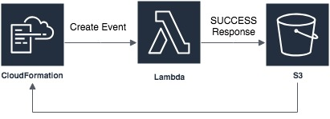
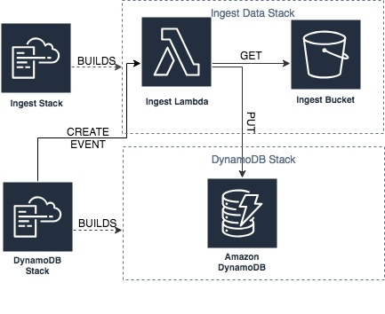

This post uses CloudFormation to create a DynamoDB table with a Lambda backed 'Custom Resource', to automatically ingest data into the DynamoDB table upon creation.

Here's a supporting [GitHub](https://github.com/janakerman/blog-relational-dynamo) project if that's what you're after!

## The Problem

For my [previous post](https://janakerman.co.uk/relational-data-in-dynamodb/) on relational data in DynamoDB, I wanted to publish a CloudFormation template so that people could run the queries in their own AWS console as they followed along. I wanted to create the DynamoDB table, pre-populated with the example used in my blog post. Understandably, CloudFormation doesn't provide any functionality for ingesting data as it is primarily a tool for managing infrastructure.

The CloudFormation template for the table itself was simple, but I needed a way to hook into the CloudFormation process. I thought of two ways of doing this:
1. Creating a script that runs the CloudFormation template and ingests the data
1. Using a CloudFormation Lambda backed CustomResource

Since option #1 is trivial, I decided to see how I might go about achieving #2, hopefully learning a little about CloudFormation along the way.

## CloudFormation Custom Resources

CloudFormation custom resources allow you to write provisioning logic that will be run anytime your stack is created, updated or deleted. It provides a hook into the CloudFormation stack lifecycle whereby you can do whatever you please. AWS document an [example](https://docs.aws.amazon.com/AWSCloudFormation/latest/UserGuide/walkthrough-custom-resources-lambda-lookup-amiids.html) whereby as part of your stack creation you can fetch latest AMI for your instance type and region. Other use cases could be:

- Managing an AWS resource unsupported by CloudFormation
- Managing infrastructure completely outside of AWS
- **Ingesting some data into your stack!**

## How It Works

The custom resource is defined with a `service token`. Reading the AWS documentation, it dictates that this should be the ARN to either a Lambda or an SNS topic - it's quite ambiguously worded so there may be more options. On create, update or delete of your CloudFormation stack, a request will be sent to this `service token`. This request contains all the information you need to update the CloudFormation stack when you've completed your custom logic. The process by which you do this is by sending a response object to a signed S3 bucket URL to notify CloudFormation of the success or failure of your logic. It's all a bit roundabout but it is quite simple.

Let's imagine we're creating a Lambda backed custom resource (we will be soon!). We would:

1. Define our custom resource in our CloudFormation template:

```yaml
Resource:
 ...
 MyCustomResource:
   Type: Custom::DataIngestLambdaTrigger # Identifies the type of your custom resource (whatever you like)
   Properties:
       ServiceToken: <ARN_OF_MY_LAMBDA>
```

The lambda you specify in `ServiceToken` will be send a request that looks **something** like this:

```json
{
 "RequestType": "Create",
 "ResponseURL": "<SIGNED_URL_TO_RESPOND_TO>",
 // ...
 "ResourceProperties": {
   "ServiceToken": "<ARN_OF_MY_LAMBDA",
   // Any other properties you defined above.
 }
}
```

Your Lambda will then be responsible to carry out its logic, and send an HTTP PUT with a body that looks **something** like this:
```json
{
   "Status": "SUCCESS",
   "Reason": "...",
   "StackId": "...",
   "RequestId": "...",
   "LogicalResourceId": "...",
   "Data": "..." // Any data to be returned to the Stack
}
```

I visualise it like this:



## Getting To Work

As per my use case, I want to spin up a DynamoDB table and ingest some data. In my little design, I planned to create an S3 bucket to hold my ingest data, create a Lambda that would read from the bucket, and write to my DynamoDB table. I broke this down into two steps:

1. A data ingest CloudFormation stack responsible for storing ingest data, and the ingest Lambda
2. A CloudFormation template for the DynamoDB table

If I tried to do it all in one CloudFormation stack, I'd have a bit of a chicken or the egg problem. My Lambda would run before I'd had a chance to upload my ingest files. Additionally, I always try to think about how I would do this on a real project and having the separation of two templates would allow us to reuse the data ingest stack for as many other DynamoDB stacks as we want. On my current project, we have different data sets for each of our environments, with the scale increasing each step you take towards production - this would definitely be useful for us if we were using DynamoDB.

_I'll be referencing this [GitHub project](https://github.com/janakerman/blog-relational-dynamo) for the rest of the post._

### The Ingest Stack

The ingest stack is a standalone stack that has three resources and a single output. The resources are, an S3 bucket for the ingest data, a role defining access permissions for the Lamda, and the Lambda with the source code inline.

```yaml
AWSTemplateFormatVersion: "2010-09-09"
Resources:
 IngestDataBucket:
   Type: AWS::S3::Bucket

 LambdaExecutionRole:
   Type: AWS::IAM::Role
   Properties:
   ...

 LambdaFunction:
   Type: "AWS::Lambda::Function"
   Properties:
     Code:
       ZipFile: !Sub |
         ...
     Description: Lambda function that ingests data into a DynamoDB table.
     FunctionName: !Join
       - '-'
       - - !Ref AWS::StackName
         - DataIngestLambda
     Handler: index.handler
     Role : !GetAtt LambdaExecutionRole.Arn
     ...
     Environment:
       Variables:
         INGEST_DATA_BUCKET: !GetAtt IngestDataBucket.Arn

Outputs:
 IngestFunctionArn:
   Description: ARN of data ingest function.
   Value: !GetAtt LambdaFunction.Arn
   Export:
     Name: !Sub "${AWS::StackName}-ingest-lambda"
```

As you can see above, the Lambda function is passed the S3 bucket's ARN as an environment variable. The stack's output is the ARN of the Lambda function, which we'll be utilising in our next stack.

It's worth noting that the `LambdaExecutionRole` is overly permissive and was set up for demo purposes. Also, I've inlined a rather large block of Javascript code for ease too, but this could get unwieldy.

If you want to follow along, now would be the time to check out the git repo and create the stack (in the project root).

`aws cloudformation update-stack --stack-name ingest-data --template-body file://./DataIngest.yaml --capabilities CAPABILITY_IAM`

If you describe the stack, you can see the ARN of the ingest Lambda function in the stack's outputs.

`aws cloudformation describe-stacks --stack-name ingest-data`

You'll see something like this:

```json
"Outputs": [
   {
       "OutputKey": "IngestFunctionArn",
       "OutputValue": "arn:aws:lambda:eu-west-2:743259902374:function:ingest-data-DataIngestLambda",
       "Description": "ARN of data ingest function.",
       "ExportName": "ingest-data-ingest-lambda"
   }
]
```

Once this stack was created, I uploaded a JSON file into my S3 bucket containing the records I wanted to load into DynamoDB.

```json
[
   { "PartitionKey": "BREAKFAST-2019-04-22", "SortKey": "BREAKFAST", "Data": "2019-04-22" },
   { "PartitionKey": "BREAKFAST-2019-04-22", "SortKey": "ORDER-001", "Data": "0" },
   { "PartitionKey": "BREAKFAST-2019-04-29", "SortKey": "BREAKFAST", "Data": "2019-04-29" },
   { "PartitionKey": "BREAKFAST-2019-04-29", "SortKey": "ORDER-002", "Data": "2019-04-29" },
   { "PartitionKey": "ITEM-001", "SortKey": "ITEM", "Data": "Bacon Sandwich" },
   { "PartitionKey": "ORDER-001", "SortKey": "USER-janakerman", "Data": "ITEM-001" },
   { "PartitionKey": "ORDER-002", "SortKey": "USER-hungry-dev", "Data": "ITEM-001" },
   { "PartitionKey": "USER-janakerman", "SortKey": "Jan Akerman", "Data": "0" },
   { "PartitionKey": "USER-hungry-dev", "SortKey": "Dev Hungry", "Data": "0" }
]
```

The logic within the Lambda itself is pretty basic. It does an S3 GET to fetch a JSON file, parses it and iterates over the data objects performing a DynamoDB put for each item. It then sends a `SUCCESS` or `FAILURE` response to the signed S3 URL once complete.

### The DynamoDB Stack

The DynamoDB stack has a single DynamoDB table configured with the structure described in relational data DynamoDB blog and a single custom resource. You'll notice it also takes two parameters, the name of the CloudFormation stack which contains the ingest lambda, and the file name of the ingest file I uploaded into S3.

```yaml
AWSTemplateFormatVersion: "2010-09-09"

Parameters:
 DataIngestStackName:
   Description: Name of the cloud formation stack which contains the data ingest lambda.
   ...
 IngestDataFile:
   Description: The data file to ingest from the ingest bucket
   ...

Resources:
 MyDynamoDBTable:
   Type: AWS::DynamoDB::Table
   ...

 DataIngestLambdaTrigger:
   Type: Custom::DataIngestLambdaTrigger
   Properties:
       ServiceToken:
         Fn::ImportValue:
           !Sub "${DataIngestStackName}-ingest-lambda"
       TargetTable: !Ref MyDynamoDBTable
       DataIngestFile: !Ref IngestDataFile
   DependsOn:
     - MyDynamoDBTable   
```

The `ServiceToken` of the custom resource is set to be the `ExportName` of the `Output` parameter of the previous stack. The Lambda is also passed two additional properties, `TargetTable` and `DataIngestFile`. These will be passed to the Lambda on its event object, and the Lambda will get the specified file, and loop over the ingest file. This is possible as the Lambda was parameterised - now any stack can pass the file and target table to ingest into.

Starting up the DynamoDB stack will cause it to trigger the ingest stack's Lambda via the custom resource, which will download the data from S3 and ingest it into the DynamoDB table before reporting a SUCCESS back to CloudFormation, completing the stack creation.

`aws cloudformation update-stack --stack-name dynamodb-stack --template-body file://./ExampleTable.yaml --parameters ParameterKey=DataIngestStackName,ParameterValue=ingest-data ParameterKey=IngestDataFile,ParameterValue=ingestData1.json`

Once the stack is completed, you should be able to check the data is in the via the console or a command line scan.

`aws dynamodb scan --table-name RelationalExampleTable`



## Summary

Using this approach you can create your environment and have it in a ready and useable state. You can see how this could be useful to spin up a test environment with some known data or ingest some initial user data from AWS Cognito, for example.

Having environment initialisation hooked into the creation of the environment gives you a known and consistent starting point, avoiding the need for human hands to get involved in some error prone manual ingest process. I believe this is so important when it comes to building a reliable CI/CD pipline.

Writing a script could have been potentially simpler, but I wouldn't have learnt about the power that custom resources give you in CloudFormation templates!

## Further considerations:
- The custom resource is called at multiple points. Here's an interesting [post](https://www.puresec.io/blog/a-deep-dive-on-aws-cloudformation-custom-resources) on the lifecycle of a custom resource.
- If your Lambda errors and doesn’t respond, this can cause the CloudFormation stack to hang until it times out (around an hour). Develop your Lambda locally with SAM local and use a mock event to test with!
- If you want to re-ingest data, updating the stack won't help you as nothing has changed, but you can invoke the Lambda directly.

