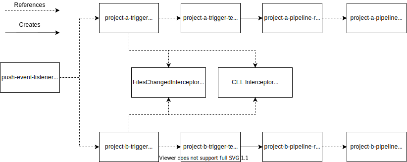

The full code described in this post can be found on [Github](https://github.com/janakerman/tekton-mono-repo-demo).

As a learning exercise, I wanted to see how I could put together a pipeline for a mono-repo with [Tekton](https://tekton.dev/). This post outlines a setup that supports the execution of _multiple_ pipelines from a single Github push event, learning a little about Tekton interceptors along the way.


## Tekton

[Tekton](https://tekton.dev/) is an open-source framework for creating CI/CD systems. With Tekton, Kubernetes CRDs (Custom Resource Definitions) define the pipelines and pipeline stages (tasks) are orchestrated as Kubernetes pods.

Tekton has recently captured my interest as I believe using CRDs to define a pipelines opens up a lot of possibilities. Possibilities that I hope to dig into further in some future posts.


## The problem

Typically, a CD pipeline would be initiated by a Git web hook, such as Github's [PushEvent](https://docs.github.com/en/developers/webhooks-and-events/github-event-types#pushevent). This web hook would trigger the repositories pipeline to execute.

Most CI/CD tools have the following features in common:
* A single pipeline definition, usually in YAML (i.e `.gitlab-ci.yaml`, `.travis.yaml`, etc)
* A set of stages that form a DAG (Directed Acyclic Graph)
* Conditional logic to support optional build stages

Modelling mono-repositories with the above features usually has a few issues:
1. Poor visibility of a sub-project within the mono-repo as a single 'pipeline' is _shared_
2. Pipeline definitions become increasingly complex, filled with conditional stages

To improve on this, I wanted to see whether using Tekton, I could trigger different pipelines depending on the sub-directories that were modified for a given Git event.

## Tekton Triggers

[Triggers](https://github.com/tektoncd/triggers) is the sub-project of Tekton that is responsible for triggering pipelines in response to external events via web hooks. Tekton's own documentation gives a good overview of the moving parts.

> EventListeners expose an addressable “Sink” to which incoming events are directed. Users can declare TriggerBindings to extract fields from events, and apply them to TriggerTemplates in order to create Tekton resources. In addition, EventListeners allow lightweight event processing using Event Interceptors.

An `EventListener` defines the endpoint for incoming events, passes the events off a list of `Trigger`s, which define  how to create a pipeline resource from the received event (using `TriggerBinding` and `TriggerTemplate` resources).  

A Tekton `Trigger` can define interceptors allow you to process HTTP request payloads before any pipeline is triggered, and potentially deciding not to execute at all. Tekton comes bundled with some out of the box interceptor implementations:
* Interceptors for common web hook sources (Gitlab, Github, Bitbucket), handling signature verification and providing filtering for specific event types.
* A [CEL Interceptor](https://tekton.dev/docs/triggers/eventlisteners/#cel-interceptors) for transforming/conditionally triggering pipelines using the CEL expression language.
* [web hook interceptors](https://tekton.dev/docs/triggers/eventlisteners/#webhook-interceptors) for implementing your own web hook processing as a Kubernetes service.


## The solution

In the pipeline setup described by this post, there's a single `EventTrigger` that references a unique `Trigger` for each project within the repo. Each `Trigger` references a `TriggerTemplate` configured to create `PipelineRun` for each sub-project's unique `Pipeline`.


The mono-repo magic is handled by the two [interceptors](https://tekton.dev/docs/triggers/eventlisteners/#interceptors) that are chained together to process incoming Github Push Events, _conditionally_ trigger a pipeline associated with each sub-directories. If one project directory is modified, only that project's pipeline will run. If both are modified, both project pipelines will run.

There is a `Trigger` resource for each sub-project. Below is Project A's.

```
apiVersion: triggers.tekton.dev/v1alpha1
kind: Trigger
metadata:
  name: service-a-trigger
spec:
  interceptors:
    - webhook:
        objectRef:
          kind: Service
          name: interceptor
          apiVersion: v1
          namespace: default
    - cel:
        filter: body.extensions.filesChanged.exists(i, i.startsWith('service-a/'))
  bindings:
    - name: service
      value: service-a
    - name: pipeline-name
      value: service-a-pipeline
  template:
    ref: mono-trigger-template
```

As can be seen above, the `Trigger` defines two interceptors:
 1. A custom web hook interceptor that decorates the incoming request's body with an additional field containing a list of modified file paths (`extensions.filesChanged`). This works by delegating the business logic to an Kubernetes service running within the cluster. This interceptor service uses Github's [Compare API](https://docs.github.com/en/github/committing-changes-to-your-project/comparing-commits#comparing-commits) to fetch the list of modified files.
2. A chained CEL interceptor specifies a `filter` predicate that will _conditionally_ trigger pipelines only if the relevant directory contains changes. This predicate is hard coded to only pass if it finds an entry in the list of modified files for it's target sub-project, `service-a/` in the case of the above `Trigger`.


## Evaluation

One of the main benefits of this approach is that a single push event can trigger multiple different pipelines, supporting unique workflows for each sub-project within the mono-repository. It's easy to find the pipeline execution for a given sub-project using either the Tekton Dashboard or `kubectl` as they are _unique_ pipelines.  



Additionally, adding a `labels` fields to the `Pipeline`'s `metadata` field means we can easily discover pipelines that are associated with a given service/sub-project.

Tekton provides more flexibility compared to other pipeline tools I've toyed with. This comes at the cost of some additional complexity as you need to stitch the building blocks together for your use case.


## Taking it further

Whilst I wouldn't say the setup is very complex, without some familiarity of Tekton the process of adding a new sub-project isn't _super_ simple. I'm not that familiar with Helm, but I _think_ this you could define this setup as a Helm chart providing a mapping of sub-projects to pipelines as a value.

Perhaps as Tekton grows in popularity, we'll see more out-of-the-box Tekton setups distributed using the same tools used to distribute applications that run on Kubernetes (e.g Helm). 
